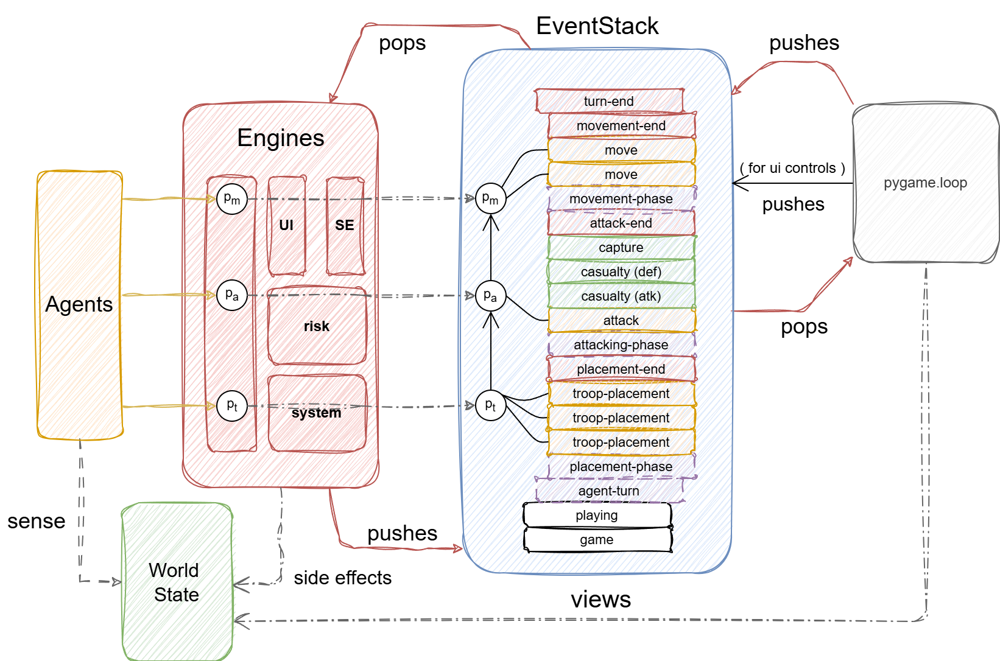
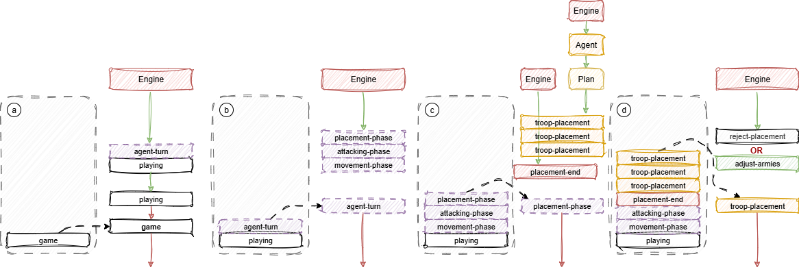

# Agent Risk

This repo contains a work-in-progress modular event-driven simulation framework,
which has been instantiated to simulate the board game called "Risk".
Currrently a work in progress, but this project stands be a test for a more
general framework for handling multi-agent simulations.

It tests several notations and techniques for handling the decision making of
agents through a complex world. The board game risk allowed us to test the plumbing
out before tackling the more complex aspects of such simulations, like temporal
and uncertainity within the visibility of the world state for agents.

A brief demonstration of how the simulation unfold is shown below:


The simulation framework revolves around an event stack, which allows us to
build out the simulation via engines. These engines react to elements popped
off the stack to generate more elements, which trigger further engines. A
simulation ends once no more elements are left on this stack.

Notably, a human can play within the simulation, but ideally all the actions
are generated from automated players. Automated agents react to the key
phases on their turn via an engine, which prompts an agent to produce a plan
of actions for that phase.

Agents may put anything on the stack, as can the human player. Humans have a
bit more hand holding than agents. But the simulation decides if these elements
placed on the stack are valid and result in side effects. Side effects are
events that change the world state. The types of events on the stack are colour
coded, and the current stack is shown in the bottom right.

## Quick Start

To run the pygame for the risk simulation of using automated agent:

```bash
python run_game.py
```

## Other Runners

### run_check_bias

### run_eval

### run_rejected_collection

## run_sim

### run_sim_from

## Current Implementation

### Architecture design plans for the simulator



### Evolution of event stack over the duration of a simulation



## Risk: The Board Game

Wikipedia (<https://en.wikipedia.org/wiki/Risk_(game)>) defines the board game of
Risk as:
> Risk is a strategy board game of diplomacy, conflict and conquest[1] for two
> to six players. The standard version is played on a board depicting a
> political map of the world, divided into 42 territories, which are grouped
> into six continents. Turns rotate among players who control armies of playing
> pieces with which they attempt to capture territories from other players, with
> results determined by dice rolls. Players may form and dissolve alliances during
> the course of the game. The goal of the game is to occupy every territory on the
> board and, in doing so, eliminate the other players.

> In addition to shared boundaries between territories which define routes of
> attack/defense, numerous special trans-oceanic or trans-sea routes are also
> marked; for example, the route between North Africa and Brazil. In the most
> recent edition of the game, there are a total of 83 attack routes between
> territories; this number has changed over time as past editions have added or
> removed some routes. The oceans and seas are not part of the playing field.

> Each Risk game comes with a number of sets (either 5 or 6) of different
> colored tokens denoting troops. A few different or larger tokens represent
> multiple (usually 5 or 10) troops. These token types are purely a convention
> for ease of representing a specific army size. If a player runs out of army
> pieces during the game, pieces of another color or other symbolic tokens
> (coins, pieces from other games, etc.) may be substituted to help keep track
> of armies.

> Setup consists of determining order of play, issuing armies to players,
> and allocating the territories on the board among players, who place one or
> more armies on each one they own.

> At the beginning of a player's turn, they receive reinforcement armies
> proportional to the number of territories held, bonus armies for holding
> whole continents, and additional armies for turning in matched sets of
> territory cards obtained by conquering new territories. The player may then
> attack, move their armies, or pass.

> On a player's turn, after they have placed their reinforcements, they may
> choose to attack territories adjacent to theirs which are occupied by enemy
> armies. A territory is adjacent if it is connected visibly by land, or by a
> "sea-lane". Attacks are decided by dice rolls, with the attacker or defender
> losing a specified number of armies per roll. When attacking, a battle may
> continue until the attacker decides to stop attacking, the attacker has no
> more armies with which to attack, or the defender has lost their last army at
> the defending territory, at which point the attacker takes over the territory
> by moving armies onto it and draws a territory card for that turn.

>At the end of a player's turn, they may move armies from one of their
> territories to another "connected" territory. A player is eliminated from the
> game when they have lost their last territory. The player that defeated them
> receive the defeated player's territory cards, if any. The victor is the last
> player remaining when all other players have been eliminated.

## Architecture

The simulation should use the `pygame` python library
(<https://pypi.org/project/pygame/> or <https://www.pygame.org/docs/>).

The architecture is split into several modules:

- The '`game`' module handles running the event loop, rendering, and user input
- The '`engine`' module includes the engines that run the show and progress
the simulation into new states.
- The '`agents`' module describes the agent behaviours for players, ideally
versions of the same agent behaviour will be recorded, but the formalism used
will change (following Action, Planning, and Learning by Malik Ghallab, Dana
Nau, Paolo Traverso). Types of formalisms to be considered are:
  - Hierarchical Task Networks
  - Behaviour Tree
  - Petri nets with Data
  - Monte Carlo Tree Search
  - Business Process Model and Notation
  - DEVS
- The '`state`' module handles the data structures for modelling the state of
the game and any other required state to ensure that each step of a simulation
can be replayed.

## Gameplay Loop

The flow of game will consisting of the following main phases

- `init`:- given $(g,p,s)$ setup the board state for agents to begin to play the
game. Where $g$ is the number of regions on the board, $p$ is the number of
players, and $s$ is the size of each players army.
- `game`:- The main event loop, which the game of risk unfolds. This phase
consits of the following phases:
  - `game turn`:- this is the main action step of the game, it consists of
    giving each active player their turn. Each active player is given control
    of the `player turn` phase consisting of:
    - `get troops` :- the game hands out `troop` events
    - `place troops` :- the agent decide where to place the new troops
    - `move troops` :- the player may move troops to "attack" adjacent
        regions. They may also decide to simply move troops to already controlled
        regions.
    - `end turn`:- the agent decides to send the end turn event to trigger
        the next player turn for other active players (if any).
  - `game turn cleanup`:- checks whether to end the game as a player has won
    or to trigger the next `game turn`.
  - `game end`:- occurs when the game has been won by a player
