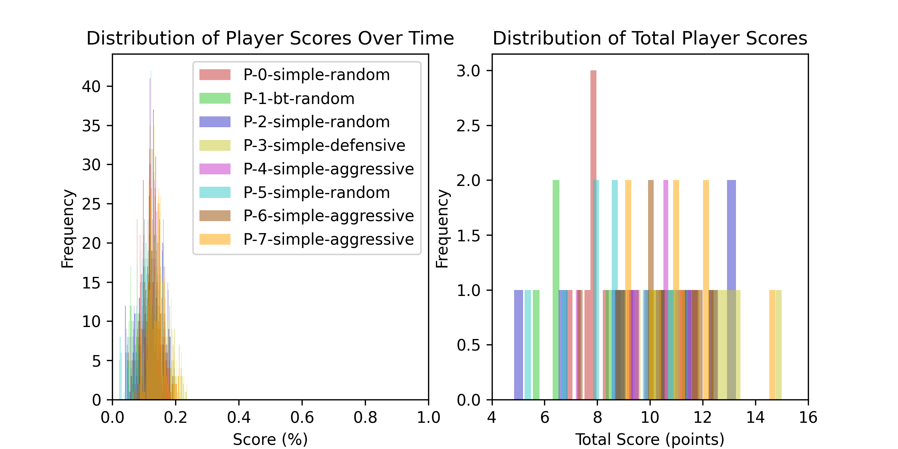
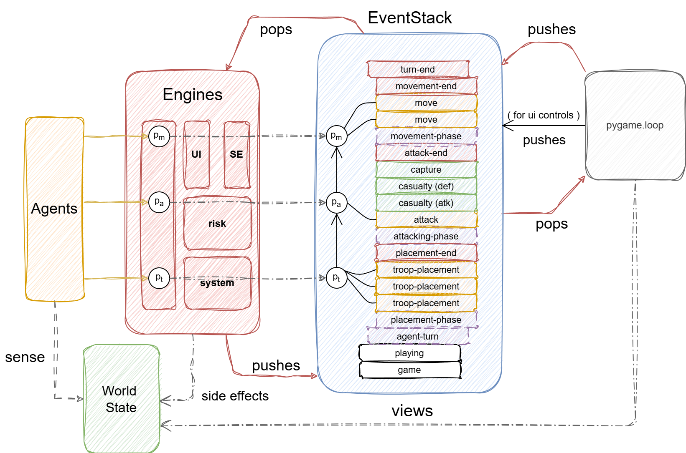
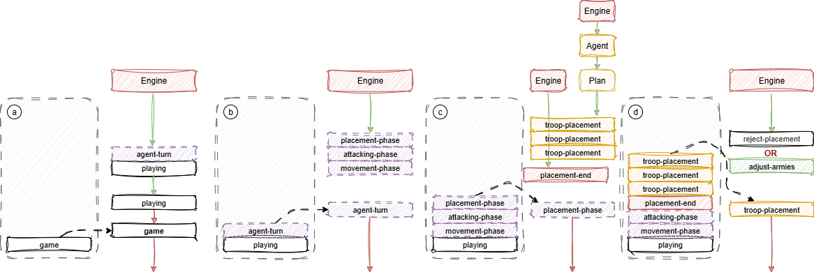

# Agent Risk

This repo contains a work-in-progress modular event-driven simulation framework
(unnamed), which has been instantiated to simulate the board game called "Risk".
This project stands as a test for a general framework for handling multi-agent simulations.

The project tests several notations and techniques for handling the decision-making of
agents through a complex simulated world.
The board game Risk allowed us to evaluate the needs of modellers working with
complex aspects of simulation studies.

A brief demonstration of how the simulation unfolds is shown below:


The simulation framework revolves around an event stack, which allows us to build
out the simulation via engines.
These engines react to elements popped off the stack to generate more elements,
which trigger further engines.
A simulation ends once no more elements are left on this stack.

Notably, a human can play within the simulation, but ideally, all the actions are
generated from automated agents.
Automated agents react to the key phases on their turn via an engine, which prompts
an agent to produce a plan of action for that phase.

Agents may put anything on the stack, as can the human player.
Though humans have a bit more hand-holding than automated agents.
But the simulation's internal engines decide whether these elements popped off the
stack are valid and result in side effects.
Side effects are events that change the world state in a reversible manner, by convention
the simulator should only modify the world state through a side effect being popped off
the stack, such as placing new troops on a territory.
The architecture does not enforce this convention, and agents should not put side effects
on the stack, but instead use a handful of events related to their possible actions.
The types of events on the stack are colour-coded, and the current stack is shown in the
bottom right in the visualisation of the simulation.

## Development Environment

In order to run the simulation, you will need an installation of Python `3.13.x`
(there might be a bit of leeway around version, but this is untested).
We used `pipenv` to record the required libraries and versions that need to be installed
for the simulator to run.

Once `pipenv` is installed, run the following command to regenerate the development environment:

```bash
pipenv sync
```

After the virtual environment is reproduced, activate the interpreter using:

```bash
pipenv shell
```

## Quick Start

To run the simulator and simulate a game of Risk, use the following command from the root directory:

```bash
py run_game.py
```

There are several arguments that can be passed to the runner.
But most notable are `-g X` to set the number of regions in the game to `X`, `-p Y` to
set the number of agents in the simulation to `Y`, and `-s Z` to set the starting number
of armies each player is given to `Z`.

Many other arguments can be passed through to adjust the speed and verbosity of the
simulator as well.

## Configuration

To configure the simulation to use a specific agent type and strategy, the `ai.config`
file should be changed.
The file is a JSON-formatted configuration for each player, where each player is
configured by two attributes (options are separated by `|`):

```json
{
  "type" : "simple|htn|bt|mcts|dpn|bpmn|devs",
  "strat" : "random|defensive|aggressive"
}
```

## Other Runners

In the root directory of the project, there are a handful of other runners for starting the
simulator, with a particular focus. Each of these runners has a different focus and
may or may not use the visual representation of the data in the simulation run, i.e.
no rendering of the current state.

### run_check_bias

This runner investigates the current agent configuration (`ai.config`) to see whether
the scores produced by the agents across a number of runs for a number of turns, differ.
It collects the turn-by-turn scores and the final scores for each agent after a simulation
run.
It uses this information to graph histograms to help identify if an agent's behaviour
is dissimilar or similar to the other agents in the configuration.
For example, the figure below shows the results of the runner, with the following parameters
`--turns 10 --runs 10`.



In order to get a good understanding of bias for an agent and strategy, a turn count of
100 and completing above 50 runs is recommended.

### run_eval

This runner handles the pairwise simulation of each agent and strategy. The only
parameter that is notable for this runner is the number of turns that each simulation
test should run for before collecting results.

This runner is threaded and will attempt to complete all runs before aggregating results.
For each pairwise simulation, we take the average results from each possible starting
position to avoid bias in metrics based on a favourable starting player.

The results from all the pairwise simulations will be stored in `./eval/eval_runs_XXXX`.
This will contain the configuration, scores, the tape, and the final state for each
simulated run. Due to the size of this folder, this repo does not track the `./eval/`
folder.

A helper runner `write_results.py` can be pointed at the evaluation directory to collect 
the results into a LaTeX table, i.e. `results.tex`.

### run_rejected_collection

Similar to the helper, `write_results.py`, for the evaluation, this runner will parse
the tapes are stored in an evaluation directory to collect rejected events.

The total number of rejected events will be split up between the agent type and strategy.
After parsing all the tapes in the specified evaluation directory, it writes the results
into `rejects.tex`.

This runner should be called in the following manner:

```bash
  py run_rejected_collection.py --path [eval_dir] --collect
```

The `--collect` arg will tell the runner to actually perform the aggregation of rejected
events into a `rejected_collection.json` in the evaluation directory.

### run_sim

This runner enacts a headless version of the simulator, running the simulation from a
known simulation state for a number of turns.
This runner is useful when looking to investigate a state or performing incremental
simulations.
A new tape and stack will be produced once the simulator finishes running.

By default, the agents used in the simulator will use the random strategy. By passing
`--configured` the runner will use the `ai.config` instead.

### run_sim_from

This runner enacts the simulator with a visual representation.
It loads the simulator pointed at a saved state of the simulation and ensures that one
player in the simulation is a human player.
This runner is useful for debugging a position or testing out the possible options for
position.

### run_over_processes

This runner is an exemplar for running the simulator in a distributed manner.
In this runner, the simulator and the visualisation are run in different processes and
elements on the tape are shared between processes.
This demonstrates that some amount of composability could be achieved through the listening
of the tape, ensuring truth across the possible sub-systems of a simulation.
Another benefit of this runner is that the choppiness of the visualisation is limited as
the visualisation is free to respond to user input while agents are planning.

There are no arguments for this runner, as it is meant to be a demonstration of
distributed communication.

## Current Implementation

This section covers high-level diagrams of the simulator's architecture.

### Architecture design plans for the simulator

At a very high level, the architecture of the simulator is shown below. Highlighting
that engines react to elements popped off an event stack within the simulator. The chain  
reaction continues until no elements are returned to the event stack.



### Evolution of event stack over the duration of a simulation

The diagram below highlights the internal steps taken within the simulator in response
to a single element being popped from the event stack.
The reaction displayed represents the start of a simulation within our simulator for
emulating the board game of Risk.
A popped element might be processed by none, one, or many engines, each of which may produce
more elements to be pushed onto the top of the stack.
Purple elements are internal phases, red elements are player phases, and yellow elements are
requests for actions, and green elements are side-effects.



## Risk: The Board Game

Our simulation mostly follows the Wikipedia article for risk
(<https://en.wikipedia.org/wiki/Risk_(game)>), which defines the board game of Risk as:
> Risk is a strategy board game of diplomacy, conflict and conquest[1] for two
> to six players. The standard version is played on a board depicting a
> political map of the world, divided into 42 territories, which are grouped
> into six continents. Turns rotate among players who control armies of playing
> pieces with which they attempt to capture territories from other players, with
> results determined by dice rolls. Players may form and dissolve alliances during
> the course of the game. The goal of the game is to occupy every territory on the
> board and, in doing so, eliminate the other players.

> In addition to shared boundaries between territories which define routes of
> attack/defense, numerous special trans-oceanic or trans-sea routes are also
> marked; for example, the route between North Africa and Brazil. In the most
> recent edition of the game, there are a total of 83 attack routes between
> territories; this number has changed over time as past editions have added or
> removed some routes. The oceans and seas are not part of the playing field.

> Each Risk game comes with a number of sets (either 5 or 6) of different
> colored tokens denoting troops. A few different or larger tokens represent
> multiple (usually 5 or 10) troops. These token types are purely a convention
> for ease of representing a specific army size. If a player runs out of army
> pieces during the game, pieces of another color or other symbolic tokens
> (coins, pieces from other games, etc.) may be substituted to help keep track
> of armies.

> Setup consists of determining order of play, issuing armies to players,
> and allocating the territories on the board among players, who place one or
> more armies on each one they own.

> At the beginning of a player's turn, they receive reinforcement armies
> proportional to the number of territories held, bonus armies for holding
> whole continents, and additional armies for turning in matched sets of
> territory cards obtained by conquering new territories. The player may then
> attack, move their armies, or pass.

> On a player's turn, after they have placed their reinforcements, they may
> choose to attack territories adjacent to theirs which are occupied by enemy
> armies. A territory is adjacent if it is connected visibly by land, or by a
> "sea-lane". Attacks are decided by dice rolls, with the attacker or defender
> losing a specified number of armies per roll. When attacking, a battle may
> continue until the attacker decides to stop attacking, the attacker has no
> more armies with which to attack, or the defender has lost their last army at
> the defending territory, at which point the attacker takes over the territory
> by moving armies onto it and draws a territory card for that turn.

>At the end of a player's turn, they may move armies from one of their
> territories to another "connected" territory. A player is eliminated from the
> game when they have lost their last territory. The player that defeated them
> receive the defeated player's territory cards, if any. The victor is the last
> player remaining when all other players have been eliminated.

## Architecture

The simulator architecture uses the `pygame` Python library
(<https://pypi.org/project/pygame/> or <https://www.pygame.org/docs/>) for the visual
representation of the simulation.

The architecture is split into several modules:

- The `game` module handles running the event loop, rendering, and user input.
- The `engine` module includes the engines that run the show and progress the simulation
into new states.
- The `agents` module describes the agent behaviours for players. We used several types
of formalisms to implement the behaviour for players, which included:
  - Hierarchical Task Networks
  - Behaviour Tree
  - Petri nets with Data
  - Monte Carlo Tree Search
  - Business Process Model and Notation
  - DEVS
- The `state` module handles the data structures for modelling the state of the game and
 any other required state to ensure that each step of a simulation can be replayed.
- The `util` module contains the shared logic for agents and utility functions for query
and running the simulation.

## Gameplay Loop

The flow of the game will consist of the following main phases

- `init`:- given $(g,p,s)$, set up the board state for agents to begin to play the
game. Where $g$ is the number of regions on the board, $p$ is the number of
players, and $s$ is the size of each player's army.
- `game`:- The main event loop, in which the game of Risk unfolds. This phase
consists of the following phases:
  - `game turn`:- this is the main action step of the game, it consists of
    giving each active player their turn. Each active player is given control
    of the `player turn` phase, consisting of:
    - `get troops` :- the game calculates the number of placements for the current agent.
    - `place troops` :- the agent decides where to place the new troops; placing all
    troops is not enforced by the simulator.
    - `attacking` :- the agent may choose to attack adjacent territories with their troops.
    - `moving` :-  the agent may choose to reorganise their troops between connected territories.
  - `game turn cleanup`:- checks whether to end the game as a player has won
    or to trigger the next `game turn`.
  - `game end`:- occurs when the game has been won by a player
